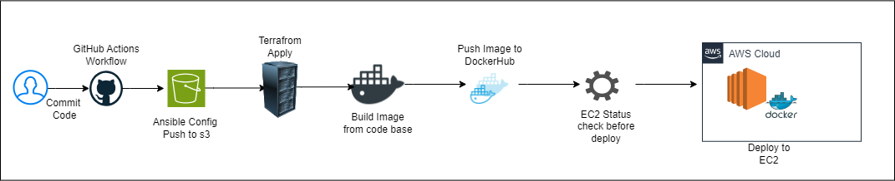

# Example Application

A small web application


## Run Locally

Clone the project

```bash
  git clone git@github.com:wadhekarpankaj/example-app.git
```

Go to the project directory

```bash
  cd example-app
```

Docker build

```bash
  docker build -t ctc-app:latest .
```

Start the container

```bash
  docker run -d -p 8000:8000 ctc-app:latest
```


## API Documentation

/start - Initiates the call to CallMe service

```bash
  curl -X 'POST' 'http://{example_service_url}:8000/start' -H 'Content-Type: application/json' -d '{"url": "http://example_service_url:8000/hello"}'
```

/hello - Captures the message from CallMe service

```bash
  curl -X 'POST' 'http://{example_service_url}:8000/hello' -H 'Content-Type: application/json' -d '{"hello": "some text"}'
```

/callback_data - Retrieve the message sent by Call Me service

```bash
  curl -X 'GET' 'http://{example_service_url}:8000/callback_data' -H 'accept: application/json'
```

/health - Health Status of API

```bash
  curl -X 'GET' 'http://{example_service_url}:8000/health' -H 'Content-Type: application/json'
```

## CI/CD Flow

